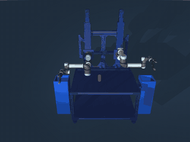

# Geodude

A Python library for bimanual robot manipulation with collision-free motion planning.

<p align="center">
  
</p>

## What It Does

Geodude controls a bimanual UR5e robot system—two arms on height-adjustable Vention rails with Robotiq grippers. It handles the hard parts of manipulation:

- **Manipulation primitives**: `robot.pickup()` and `robot.place()` with automatic affordance discovery
- **Motion planning**: Find collision-free paths using CBiRRT with TSR goals
- **Grasp-aware collision**: Objects you're holding don't collide with your arm
- **Unified planning API**: Simple `plan_to()` with automatic arm selection and height search
- **Execution context**: Same code works for simulation and hardware deployment
- **Time-optimal trajectories**: TOPP-RA retiming respects joint velocity/acceleration limits

## Installation

```bash
uv add geodude geodude_assets
```

## Quick Start

```python
from geodude import Geodude

# Initialize robot (loads MuJoCo model)
robot = Geodude()

# Run in simulation context
with robot.sim() as ctx:
    robot.go_to("ready")
    ctx.sync()

    # Plan a motion (returns Trajectory)
    import numpy as np
    goal = np.array([-1.0, -1.5, 1.5, -1.5, -1.5, 0])
    trajectory = robot.right_arm.plan_to(goal)

    # Execute via context
    ctx.execute(trajectory)

    # Gripper control via context
    ctx.arm("right").grasp("object_name")
    ctx.arm("right").release("object_name")
```

## Manipulation Primitives

High-level `pickup()` and `place()` automatically discover how to manipulate objects:

```python
robot = Geodude(objects={"can": 1, "recycle_bin": 2})

# Activate objects in scene
robot.env.registry.activate("can", pos=[0.4, -0.3, 0.82])
robot.env.registry.activate("recycle_bin", pos=[0.75, -0.35, 0.0])  # Floor-standing

with robot.sim() as ctx:
    robot.go_to("ready")

    # Pick up any pickable object (discovers grasp TSRs automatically)
    robot.pickup("can_0")

    # Place in bin (discovers place TSRs automatically)
    robot.place("recycle_bin_0")
```

The primitives:
- **Randomize arm selection** for variety
- **Batch all compatible TSRs** and let CBiRRT find the best path
- **Handle grasp management** (attach/detach objects)
- **Lift after grasp** to clear the table

### Adding New Objects

To make an object pickable/placeable, add TSR templates in `tsr_templates/`:

**1. Grasp TSR** (`tsr_templates/grasps/bottle_side_grasp.yaml`):
```yaml
name: Bottle Side Grasp
task: grasp
subject: robotiq_2f140      # Which gripper this works with
reference: bottle           # Object type (matches asset name)

position:
  type: shell
  axis: z
  radius: [0.0, 0.05]
  height: [-0.03, 0.03]
  angle: [0, 360]

orientation:
  approach: radial
  roll: [-15, 15]
  pitch: [-15, 15]

standoff: 0.19
```

**2. Place TSR** (`tsr_templates/places/recycle_bin_drop.yaml`):
```yaml
name: Recycle Bin Drop
task: recycle               # Task type (recycle, place, drop all work)
subject: robotiq_2f140
reference: recycle_bin      # Destination type

position:
  type: box
  x: [-0.05, 0.05]
  y: [-0.05, 0.05]
  z: [0.50, 0.55]           # Height above bin

orientation:
  approach: -z              # Palm down
  yaw: [0, 360]

standoff: 0.0
```

**3. Load the object** from `prl_assets`:
```python
robot = Geodude(objects={"bottle": 1, "recycle_bin": 1})
```

That's it! The affordance registry auto-discovers TSRs by matching `reference` (object type) and `subject` (gripper type).

## Execution Context

The execution context provides a unified interface for simulation and hardware:

```python
# Simulation (kinematic - instant, perfect tracking)
with robot.sim(physics=False) as ctx:
    trajectory = robot.right_arm.plan_to(goal)
    ctx.execute(trajectory)
    ctx.sync()  # Sync viewer

# Simulation (physics - realistic dynamics)
with robot.sim(physics=True) as ctx:
    trajectory = robot.right_arm.plan_to(goal)
    ctx.execute(trajectory)
```

The context handles:
- **Trajectory execution**: `ctx.execute(trajectory)` or `ctx.execute(plan_result)`
- **Gripper operations**: `ctx.arm("right").grasp("can")`, `ctx.arm("left").release("box")`
- **Viewer sync**: `ctx.sync()` updates the MuJoCo viewer
- **Run loop**: `while ctx.is_running():` continues until viewer is closed

## TSR-Based Planning

Plan to grasp regions instead of fixed poses using Task Space Regions:

```python
from geodude.tsr_utils import create_side_grasp_tsr

# Get object pose
obj_pose = robot.get_object_pose("can")

# Create grasp TSR (allows rotation around object axis)
grasp_tsr = create_side_grasp_tsr(obj_pose, object_height=0.12)

# Plan to any valid grasp (returns Trajectory)
with robot.sim() as ctx:
    trajectory = robot.right_arm.plan_to_tsr(grasp_tsr)
    ctx.execute(trajectory)
    ctx.arm("right").grasp("can")
```

## Unified Planning API

The `plan_to_tsr()` method handles arm selection and base height search automatically:

```python
with robot.sim() as ctx:
    # Plan with both arms at multiple base heights
    # Default: randomly picks first arm, interleaves at each height level
    result = robot.plan_to_tsr(
        grasp_tsr,
        base_heights=[0.2, 0.0, 0.4],  # Middle height first (most versatile)
    )

    if result:
        print(f"Success: {result.arm.side} @ {result.base_height}m")
        ctx.execute(result)  # Executes base + arm trajectories
```

For explicit control over the search order:

```python
# Explicit (arm, height) sequence
result = robot.plan_to_tsr(
    grasp_tsr,
    sequence=[
        ("right", 0.2),
        ("left", 0.2),
        ("right", 0.0),
        ("left", 0.0),
    ],
)
```

Single-arm planning with height search:

```python
# Plan with one arm at multiple heights
result = robot.right_arm.plan_to_tsr(
    grasp_tsr,
    base_heights=[0.2, 0.0, 0.4],
)
# Returns PlanResult with arm_trajectory and base_trajectory
```

## Grasp Management

When you grasp an object, collision checking updates automatically:

```python
with robot.sim() as ctx:
    # Grasp via context (recommended)
    ctx.arm("right").grasp("can")

    # Now planning treats the can as part of the robot
    # (won't report false collisions with the arm)
    place_traj = robot.right_arm.plan_to_tsr(place_tsr)
    ctx.execute(place_traj)

    # Release via context
    ctx.arm("right").release("can")
```

For manual control:

```python
# Mark object as grasped
robot.grasp_manager.mark_grasped("can", "right")
robot.grasp_manager.attach_object("can", "right_ur5e/gripper/right_follower")

# Release
robot.grasp_manager.mark_released("can")
robot.grasp_manager.detach_object("can")
```

## Architecture

### Component Overview

```
Geodude
├── left_arm / right_arm (Arm)
│   ├── Planning (CBiRRT + EAIK)
│   ├── plan_to(), plan_to_tsr(), plan_to_pose()
│   └── Gripper control
├── left_base / right_base (VentionBase)
│   └── Height adjustment with collision checking
├── GraspManager
│   └── Tracks grasped objects, updates collision groups
├── AffordanceRegistry
│   └── Auto-discovers grasp/place TSRs from templates
├── SimContext (via robot.sim())
│   └── Unified execution for simulation
└── Collision checkers
    └── Grasp-aware collision checking
```

### Ownership Model

The framework separates **planning** (what to do) from **execution** (how to do it):

| Component | Owns | Responsibilities |
|-----------|------|------------------|
| **Robot/Arm** | Planning & State | Motion planning, IK, collision checking, grasp management, TSR registry |
| **Context** | Execution | Trajectory execution, gripper actuation, state synchronization, hardware abstraction |

**Robot/Arm** is stateless with respect to execution—it plans trajectories but doesn't know whether they'll run in simulation or on hardware. This keeps planning logic portable.

**Context** handles the messy reality of execution: timing, physics, hardware communication, error recovery. Different contexts (sim, hardware) implement the same interface.

**The context manager** (`robot.sim()`, `robot.hardware()`) wires them together:

```python
with robot.sim() as ctx:
    # Robot plans trajectories (doesn't know about sim vs hardware)
    trajectory = robot.right_arm.plan_to(goal)

    # Context executes them (knows exactly how)
    ctx.execute(trajectory)

    # Gripper ops go through context (updates robot's grasp state)
    ctx.arm("right").grasp("can")
```

### Design Principles

The architecture is designed for **multi-robot reusability**:

1. **Robots implement interfaces, not inheritance** — Different robots (Geodude, HERB, Fetch) can implement the same planning/execution interfaces without sharing a base class.

2. **TSRs live with objects, not robots** — Grasp and place TSRs are stored in `prl_assets` alongside object models. Any robot with a compatible hand can use them.

3. **Hand compatibility, not robot compatibility** — TSRs declare which hands they work with (`robotiq_2f_140`, `wsg_50`). The robot queries its hand type to find compatible TSRs.

4. **Context abstracts deployment** — The same manipulation code runs in kinematic sim, physics sim, or hardware by changing only the context.

This separation allows:
- Reusable manipulation primitives that work across robots
- Objects that "just work" when added to the asset manager
- Easy testing (kinematic sim) before deployment (hardware)

## Examples

```bash
# Recycling demo - pick up objects and place in bins
uv run mjpython examples/recycle.py

# Same demo with manual TSR loading (educational)
uv run mjpython examples/recycle_manual.py

# Planning API demo with base height search
uv run mjpython examples/arm_planning.py
```

### Recycling Demo

The `recycle.py` demo shows the power of affordance-based manipulation:

```python
# Core loop is just 3 lines:
target = robot.get_pickable_objects()[0]  # Find what to pick
robot.pickup(target)                       # Pick it up
robot.place("recycle_bin_0")              # Place in bin
```

The demo:
- Works with **any object** that has grasp/place TSRs defined
- **Randomizes** which arm picks up for variety
- **Auto-discovers** all compatible grasps and sends them to the planner
- Uses **same-side placement** (right arm → right bin) for reliability

## Testing

```bash
uv run pytest
```

## Dependencies

Core libraries developed by our lab:

- [**pycbirrt**](https://github.com/siddhss5/pycbirrt): CBiRRT motion planner with TSR constraints
- [**tsr**](https://github.com/personalrobotics/tsr): Task Space Region definitions
- [**geodude_assets**](https://github.com/personalrobotics/geodude_assets): Robot models and meshes for Geodude (UR5e + Robotiq)
- [**prl_assets**](https://github.com/personalrobotics/prl_assets): Reusable object models (cans, bins, etc.)
- [**mj_environment**](https://github.com/personalrobotics/mj_environment): MuJoCo environment wrapper with object registry
- [**asset_manager**](https://github.com/personalrobotics/asset_manager): Loads objects from meta.yaml files

External dependencies:

- [**eaik**](https://github.com/Verdant-Robotics/eaik): Analytical inverse kinematics for UR robots
- [**toppra**](https://github.com/hungpham2511/toppra): Time-optimal path parameterization
- [**mujoco**](https://github.com/google-deepmind/mujoco): Physics simulation

## License

MIT
